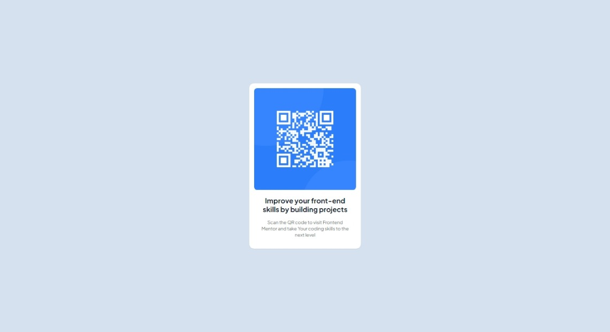

# Frontend Mentor - QR code component solution

This is a solution to the [QR code component challenge on Frontend Mentor](https://www.frontendmentor.io/challenges/qr-code-component-iux_sIO_H). Frontend Mentor challenges help you improve your coding skills by building realistic projects. 

## Table of contents

- [Overview](#overview)
  - [Screenshot](#screenshot) 
- [My process](#my-process)
  - [Built with](#built-with)
  - [What I learned](#what-i-learned)
  - [Continued development](#continued-development) 
- [Author](#author)
- [Acknowledgments](#acknowledgments) 

## Overview

### Screenshot

  

## My process

### Built with 
- [React](https://reactjs.org/) - JS library
- [Next.js](https://nextjs.org/) - React framework 
- [Tailwindcss](https://tailwindcss.com/) - CSS framework  

### What I learned

This is my first take on how to create a simple component using the reactjs and nextjs. I just copied the template design without further customizing.  

### Continued development

In the future, I want to learn more techniques and design patterns to create a more lively UI/UX.
 
## Author

<!-- - Website - [rhonstratos](https://www.your-site.com) -->
- Frontend Mentor - [@rhonstratos](https://www.frontendmentor.io/profile/rhonstratos)
- Github - [rhonstratos](https://github.com/rhonstratos) 
## Acknowledgments

Coach: [Minosuke](https://jrla1219.web.app/) 